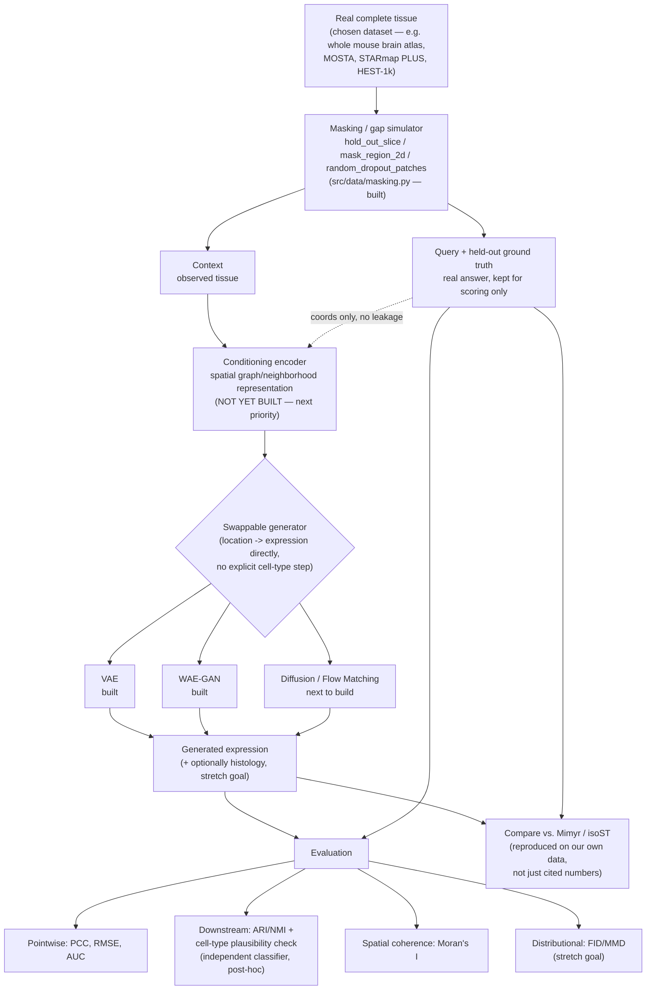

# Architecture Plan: Model-Agnostic Generative Pipeline

Last updated: 2026-07-13. Captures the design discussed for building one
architecture that can swap between VAE / WAE-GAN / diffusion backbones
(and later, different conditioning strategies and metrics) without
rewriting data, training, or evaluation code.

## The core problem

Swapping VAE ↔ GAN ↔ diffusion isn't just swapping a network — each family
has a genuinely different **training loop** and **sampling procedure**:
- VAE: one forward pass, ELBO loss, one optimizer.
- GAN: alternating generator/discriminator updates, two optimizers.
- Diffusion: training step is noise-prediction on a random timestep;
  sampling is a separate iterative loop (dozens–thousands of steps), not a
  forward pass.

A single shared `model.loss()` call (the original design) works for VAE but
breaks for the other two. The architecture has to abstract over training
*procedure*, not just network shape.

## Four-layer decomposition

1. **Conditioning encoder (shared, family-agnostic)** — turns `context`
   (neighboring cells/spatial graph) into a fixed representation, e.g. a
   GNN/transformer over a k-NN spatial graph → a set of tokens. Built once,
   consumed identically by every model family. This is the actual reusable
   "general architecture" contribution — not yet implemented (see Status
   below), current models are unconditioned placeholders. **DRIFT**
   (`docs/literature_review.md`) is a plausible concrete design reference
   for this layer — heat-kernel diffusion over a spatial adjacency graph to
   produce a spatially-coherent representation, worth reading before
   designing this from scratch.
2. **Backbone registry** — small swappable network pieces (denoiser,
   encoder+decoder, generator+discriminator) that plug into layer 3.
3. **Model family wrapper (`BaseGenerativeModel`)** — every family
   implements the same interface, differently internally:
   ```
   BaseGenerativeModel(pytorch_lightning.LightningModule):
     sample(context, query) -> output      # the ONE entry point for generation,
                                            # regardless of family internals
     training_step(batch, batch_idx)       # Lightning entry point; VAE: ELBO.
                                            # WAE-GAN: alternates encoder/decoder
                                            # vs. discriminator internally.
     configure_optimizers()                # 1 optimizer (VAE), or a list
                                            # (WAE-GAN: [opt_ae, opt_disc])
   ```
   Built on `pytorch_lightning.LightningModule` specifically for its
   multi-optimizer "manual optimization" mode (`automatic_optimization =
   False`), which is what makes GAN-style alternating updates possible
   without hand-rolling optimizer bookkeeping.
4. **Metrics — fully decoupled.** Every family's `sample()` returns the same
   output shape, so `src/evaluation/metrics.py` never needs to know which
   family produced it. No changes needed here for new model families.

## Workflow schematic



Two things this diagram makes explicit: (1) the held-out ground truth
(`D`) only ever touches evaluation (`K`) and the comparison step (`L`) —
never the generator — so there's no leakage; (2) the conditioning encoder
(`E`) is the one box in the whole pipeline that doesn't exist yet.

## Build vs. reuse

Most infrastructure is either already built or nearly free via existing
dependencies — the real work is the conditioning encoder and each family's
generator/loss logic.

| Component | Status |
|---|---|
| Data loading, masking simulators | Already built (`src/data/`) |
| Pointwise metrics (PCC, RMSE, AUC) | Already built (`src/evaluation/metrics.py`) |
| FID/MMD skeleton | Already built, needs a real embedding once chosen |
| ARI/NMI | One-liner via `sklearn.metrics` |
| Moran's I / Geary's C | Free via `squidpy.gr.spatial_autocorr` |
| Training loop plumbing (checkpointing, device mgmt, multi-optimizer) | Free via `pytorch_lightning` |
| Diffusion noise scheduling + sampling loop math | Free via `diffusers` schedulers, once we add a diffusion family |
| VAE encoder/decoder | Built (`registry.py` `VAEBaseline`) |
| WAE-GAN encoder/decoder/discriminator | Built (`registry.py` `WAEGAN`) |
| **Conditioning encoder** | **Not yet built — real work, next priority** |
| Dataset-specific adapter for the chosen pilot dataset | Not yet built — blocked on Phase 1 (`docs/project_outline.md`) |

## WAE-GAN (first GAN-family entry)

Chosen over a vanilla conditional GAN for lower implementation/training
risk. From Tolstikhin et al. 2017 (`docs/literature_review.md`,
`docs/metrics_notes.md` §4) — keeps a plain deterministic encoder/decoder
with a normal reconstruction loss, and replaces the VAE's KL term with a
discriminator that only regularizes the *encoder's aggregated latent
distribution* toward the prior. The adversarial part is a smaller,
better-behaved sub-problem than a vanilla GAN that generates expression
directly through the discriminator signal — appropriate given how sparse
and zero-inflated gene expression data is, which vanilla GANs tend to
handle poorly.

Training step (`WAEGAN.training_step`, manual optimization):
1. Encode real expression → `z_fake`. Sample `z_real ~ N(0, I)` (the prior).
2. **Discriminator step**: binary classify `z_real` vs. `z_fake` (detached).
3. **Encoder/decoder step**: reconstruction loss (`decoder(z_fake)` vs.
   input) + adversarial loss (encourage `z_fake` to fool the discriminator).

Generation (`sample()`) never touches the encoder or discriminator — decode
`z ~ prior`, identical to the VAE path. This means WAE-GAN and VAE are
interchangeable at inference time from the pipeline's point of view, which
is exactly the point of the shared interface.

## Design decision: no explicit cell-type conditioning

Where this architecture deliberately diverges from Mimyr (the closest prior
art — see `docs/literature_review.md`): Mimyr generates location → cell
type (discrete classifier) → expression (conditioned on that type). We
generate **location → expression directly**, with no discrete cell-type
commitment inside the generation path.

Rationale:
- **Bias/information bottleneck**: forcing continuous expression variation
  through a fixed, externally-imposed cell-type taxonomy discards real
  biological signal (transitional states, within-type variation, states not
  in the reference taxonomy).
- **Error propagation**: a misclassified cell type in Mimyr's pipeline
  becomes a wrong conditioning signal for expression generation — a
  compounding failure mode structurally built into a 3-stage chain.
- **Generalizability**: Mimyr's cell-type stage requires a target dataset
  with a taxonomy compatible with (or retrained against) its reference
  annotations. Skipping it removes that dependency.

**This is a trade-off, not a free win** — worth stating plainly, not
overselling: explicit type conditioning is also a real efficiency scaffold,
giving the expression generator a strong, low-dimensional signal about which
region of expression-space to target. Removing it is a harder, less
structured learning problem, likely to need more data/capacity to match
Mimyr's sample efficiency. The bet being made here is that the bias/
generalizability gain outweighs that cost — to be checked empirically, not
assumed.

**Mode-averaging risk — the reason the backbone choice matters here
specifically**: without a discrete type variable, a location can be
genuinely multimodal (e.g. a boundary between two cell types). A model
trained with a plain reconstruction loss (MSE, vanilla VAE) tends to
collapse multimodal targets to their average — a blurry profile matching
neither real type. Diffusion and GAN-style models don't have this failure
mode the same way, because they sample from the distribution rather than
regress to a conditional mean. This is a concrete, checkable reason to
compare backbones on this task specifically, independent of the general
"try different things" motivation.

**Validation plan**: train an independent cell-type classifier on held-out
real data (never seen during generation training). Run it on generated
expression profiles and compare predicted type against the true type at the
real held-out location. This reuses the ARI/NMI downstream-task-preservation
metric already planned in `docs/metrics_notes.md` §1 — it now doubles as the
check on whether skipping explicit cell-typing was the right call, not just
a generic quality metric.

## Comparison target: Mimyr

Mimyr is the primary benchmark, not just a literature reference — same
core task (full expression reconstruction, both missing-region and
missing-slice cases, real neighbor-conditioning with a prior-based
fallback), close enough that a head-to-head comparison is meaningful.
isoST is the secondary reference specifically for Track B framing
(continuous SDE field vs. our discrete point-cloud generation). Code for
both is public (`gkrieg/mimyr`, `deng-ai-lab/isoST`) — reproducing their
numbers on our own pilot dataset, not just citing their reported results, is
the honest way to compare.

Worth being explicit about why this project is worth doing given Mimyr
already exists and does the core task: the point isn't that the task is
unsolved. It's building and understanding a working version ourselves,
checking empirically whether removing the cell-type bottleneck actually
helps (see "Design decision" above), and doing it on our own chosen data —
legitimate internship-scale goals independent of whether the field's
central problem is novel.

## Prioritization — settled roster (2026-07-13)

`vae_baseline` (done) stays in the registry as the floor/plumbing-proof
baseline, not counted as one of the three comparison models below.

1. **WAE-GAN** — done. GAN entry point (Tolstikhin et al. 2017).
2. **Flow Matching, OT path (FM-OT)** — next to build. One shared
   denoiser/velocity network; diffusion-path training is a cheap config-flag
   ablation on the same network afterward, not a separate model or a
   priority in its own right. EMDiffuse's actual contribution (missing-
   slice conditioning/task design, `docs/literature_review.md`) informs how
   this model is conditioned, not a separate registry entry. `diffusers`
   schedulers/utilities handle sampling-loop math where applicable; we
   write the velocity-field network and the conditional-flow-matching
   training objective.
3. **VQ-VAE + autoregressive transformer** — promoted from stretch to core.
   Genuinely distinct paradigm (discrete latent, autoregressive sampling)
   with real quantitative precedent (`docs/literature_review.md`'s Nature
   Machine Intelligence brain-generation paper beat GAN baselines by up to
   2 orders of magnitude on FID/MMD). Known costs, accepted: a new
   tokenizer/codebook needs its own design, and autoregressive sampling is
   slower than the alternatives — relevant since FID/MMD evaluation needs
   many generated samples per comparison.
4. **Normalizing flows** — deprioritized; invertibility constraints on the
   network are restrictive and there's no prior-art pull toward it here.

## Known gaps / next steps
- All current models (`interp_baseline`, `vae_baseline`, `wae_gan`) are
  **unconditioned placeholders** — they ignore `context`/`query['coords']`
  beyond trivial use. Building the conditioning encoder (layer 1) is the
  next real architecture task, and should happen before or alongside
  picking a pilot dataset, since the encoder design depends on data
  representation (point cloud/graph vs. fixed patches — see
  `docs/project_outline.md` Phase 4).
- `src/training/train.py` now drives training through
  `pytorch_lightning.Trainer`, wrapping the current single-batch debug
  setup in a placeholder `_SingleBatchDataset`. Replace with a real
  per-cell/mini-batch `Dataset` once a pilot dataset is chosen — the
  model interface does not need to change when that happens.
- Neither FM-OT nor VQ-VAE + autoregressive (prioritization items 2 and 3
  above) is implemented yet — only `vae_baseline` and `wae_gan` exist in the
  registry.
- **Histology image reconstruction is out of current scope, tracked as a
  stretch goal.** Filling in broken tissue "in histology image" as well as
  gene expression was raised as a possible extension — HEST-1k's paired
  H&E data and the RNA-CDM/MORPHE precedents (`docs/literature_review.md`)
  make this feasible, but adding a second output modality multiplies scope
  (a second loss, a second embedding space, a second set of metrics) before
  the primary GEX pipeline works end-to-end on even one backbone. Revisit
  once VAE/WAE-GAN/diffusion are all working on expression alone.
