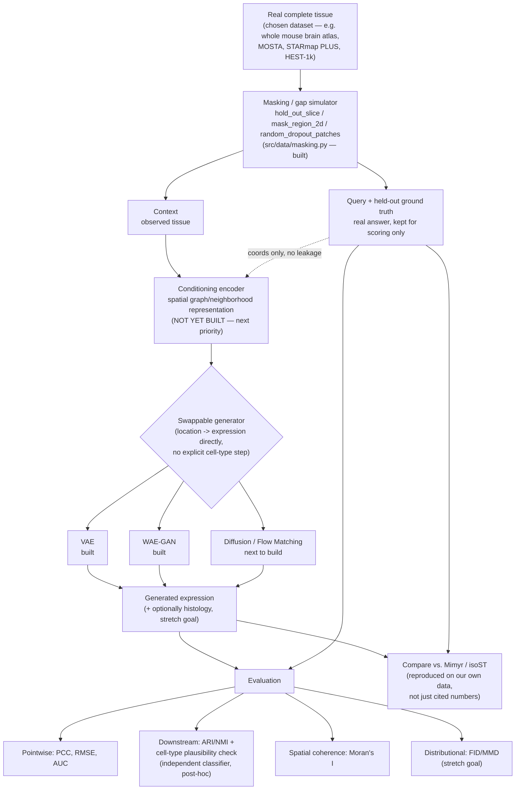

# Architecture Plan: Model-Agnostic Generative Pipeline

Last updated: 2026-07-13. Captures the design discussed for building one
architecture that can swap between VAE / WAE-GAN / diffusion backbones
(and later, different conditioning strategies and metrics) without
rewriting data, training, or evaluation code.

## The core problem

Swapping VAE ↔ GAN ↔ diffusion isn't just swapping a network — each family
has a genuinely different **training loop** and **sampling procedure**:
- VAE: one forward pass, ELBO loss, one optimizer.
- GAN: alternating generator/discriminator updates, two optimizers.
- Diffusion: training step is noise-prediction on a random timestep;
  sampling is a separate iterative loop (dozens–thousands of steps), not a
  forward pass.

A single shared `model.loss()` call (the original design) works for VAE but
breaks for the other two. The architecture has to abstract over training
*procedure*, not just network shape.

## Four-layer decomposition

1. **Conditioning encoder (shared, family-agnostic)** — turns `context`
   (neighboring cells/spatial graph) into a fixed representation via a k-NN
   spatial graph + attention. **Built** — `src/models/conditioning.py`
   (`SpatialContextEncoder`), grounded in peer-reviewed work (Rahimi &
   Recht 2007, Tancik et al. 2020 for coordinate encoding; SpaGCN, GraphST,
   GAAEST for k-NN graph attention specifically in ST — full citations in
   the module docstring), not derived from any single unreviewed preprint.
   Not yet executed/verified, not yet wired into any generator model.
2. **Backbone registry** — small swappable network pieces (denoiser,
   encoder+decoder, generator+discriminator) that plug into layer 3.
3. **Model family wrapper (`BaseGenerativeModel`)** — every family
   implements the same interface, differently internally:
   ```
   BaseGenerativeModel(pytorch_lightning.LightningModule):
     sample(context, query) -> output      # the ONE entry point for generation,
                                            # regardless of family internals
     training_step(batch, batch_idx)       # Lightning entry point; VAE: ELBO.
                                            # WAE-GAN: alternates encoder/decoder
                                            # vs. discriminator internally.
     configure_optimizers()                # 1 optimizer (VAE), or a list
                                            # (WAE-GAN: [opt_ae, opt_disc])
   ```
   Built on `pytorch_lightning.LightningModule` specifically for its
   multi-optimizer "manual optimization" mode (`automatic_optimization =
   False`), which is what makes GAN-style alternating updates possible
   without hand-rolling optimizer bookkeeping.
4. **Metrics — fully decoupled.** Every family's `sample()` returns the same
   output shape, so `src/evaluation/metrics.py` never needs to know which
   family produced it. No changes needed here for new model families.

## Workflow schematic



Two things this diagram makes explicit: (1) the held-out ground truth
(`D`) only ever touches evaluation (`K`) and the comparison step (`L`) —
never the generator — so there's no leakage; (2) the conditioning encoder
(`E`) is the one box in the whole pipeline that doesn't exist yet.

## Build vs. reuse

Most infrastructure is either already built or nearly free via existing
dependencies — the real work is the conditioning encoder and each family's
generator/loss logic.

| Component | Status |
|---|---|
| Data loading, masking simulators | Already built (`src/data/`) |
| Pointwise metrics (PCC, RMSE, AUC) | Already built (`src/evaluation/metrics.py`) |
| FID/MMD skeleton | Already built, needs a real embedding once chosen |
| ARI/NMI | One-liner via `sklearn.metrics` |
| Moran's I / Geary's C | Free via `squidpy.gr.spatial_autocorr` |
| Training loop plumbing (checkpointing, device mgmt, multi-optimizer) | Free via `pytorch_lightning` |
| Diffusion noise scheduling + sampling loop math | Free via `diffusers` schedulers, once we add a diffusion family |
| VAE encoder/decoder | Built (`registry.py` `VAEBaseline`) |
| WAE-GAN encoder/decoder/discriminator | Built (`registry.py` `WAEGAN`) |
| **Conditioning encoder** | **Not yet built — real work, next priority** |
| Dataset-specific adapter for the chosen pilot dataset | Not yet built — blocked on Phase 1 (`docs/project_outline.md`) |

## WAE-GAN (first GAN-family entry)

Chosen over a vanilla conditional GAN for lower implementation/training
risk. From Tolstikhin et al. 2017 (`docs/literature_review.md`,
`docs/metrics_notes.md` §4) — keeps a plain deterministic encoder/decoder
with a normal reconstruction loss, and replaces the VAE's KL term with a
discriminator that only regularizes the *encoder's aggregated latent
distribution* toward the prior. The adversarial part is a smaller,
better-behaved sub-problem than a vanilla GAN that generates expression
directly through the discriminator signal — appropriate given how sparse
and zero-inflated gene expression data is, which vanilla GANs tend to
handle poorly.

Training step (`WAEGAN.training_step`, manual optimization):
1. Encode real expression → `z_fake`. Sample `z_real ~ N(0, I)` (the prior).
2. **Discriminator step**: binary classify `z_real` vs. `z_fake` (detached).
3. **Encoder/decoder step**: reconstruction loss (`decoder(z_fake)` vs.
   input) + adversarial loss (encourage `z_fake` to fool the discriminator).

Generation (`sample()`) never touches the encoder or discriminator — decode
`z ~ prior`, identical to the VAE path. This means WAE-GAN and VAE are
interchangeable at inference time from the pipeline's point of view, which
is exactly the point of the shared interface.

## Design decision: no explicit cell-type conditioning

Where this architecture deliberately diverges from Mimyr (the closest prior
art — see `docs/literature_review.md`): Mimyr generates location → cell
type (discrete classifier) → expression (conditioned on that type). We
generate **location → expression directly**, with no discrete cell-type
commitment inside the generation path.

Rationale:
- **Bias/information bottleneck**: forcing continuous expression variation
  through a fixed, externally-imposed cell-type taxonomy discards real
  biological signal (transitional states, within-type variation, states not
  in the reference taxonomy).
- **Error propagation**: a misclassified cell type in Mimyr's pipeline
  becomes a wrong conditioning signal for expression generation — a
  compounding failure mode structurally built into a 3-stage chain.
- **Generalizability**: Mimyr's cell-type stage requires a target dataset
  with a taxonomy compatible with (or retrained against) its reference
  annotations. Skipping it removes that dependency.

**This is a trade-off, not a free win** — worth stating plainly, not
overselling: explicit type conditioning is also a real efficiency scaffold,
giving the expression generator a strong, low-dimensional signal about which
region of expression-space to target. Removing it is a harder, less
structured learning problem, likely to need more data/capacity to match
Mimyr's sample efficiency. The bet being made here is that the bias/
generalizability gain outweighs that cost — to be checked empirically, not
assumed.

**Mode-averaging risk — the reason the backbone choice matters here
specifically**: without a discrete type variable, a location can be
genuinely multimodal (e.g. a boundary between two cell types). A model
trained with a plain reconstruction loss (MSE, vanilla VAE) tends to
collapse multimodal targets to their average — a blurry profile matching
neither real type. Diffusion and GAN-style models don't have this failure
mode the same way, because they sample from the distribution rather than
regress to a conditional mean. This is a concrete, checkable reason to
compare backbones on this task specifically, independent of the general
"try different things" motivation.

**Validation plan**: train an independent cell-type classifier on held-out
real data (never seen during generation training). Run it on generated
expression profiles and compare predicted type against the true type at the
real held-out location. This reuses the ARI/NMI downstream-task-preservation
metric already planned in `docs/metrics_notes.md` §1 — it now doubles as the
check on whether skipping explicit cell-typing was the right call, not just
a generic quality metric.

## Comparison target: Mimyr

Mimyr is the primary benchmark, not just a literature reference — same
core task (full expression reconstruction, both missing-region and
missing-slice cases, real neighbor-conditioning with a prior-based
fallback), close enough that a head-to-head comparison is meaningful.
isoST is the secondary reference specifically for Track B framing
(continuous SDE field vs. our discrete point-cloud generation). Code for
both is public (`gkrieg/mimyr`, `deng-ai-lab/isoST`) — reproducing their
numbers on our own pilot dataset, not just citing their reported results, is
the honest way to compare.

Worth being explicit about why this project is worth doing given Mimyr
already exists and does the core task: the point isn't that the task is
unsolved. It's building and understanding a working version ourselves,
checking empirically whether removing the cell-type bottleneck actually
helps (see "Design decision" above), and doing it on our own chosen data —
legitimate internship-scale goals independent of whether the field's
central problem is novel.

## Prioritization — settled roster (2026-07-13)

`vae_baseline` (done) stays in the registry as the floor/plumbing-proof
baseline, not counted as one of the three comparison models below.

1. **WAE-GAN** — done. GAN entry point (Tolstikhin et al. 2017).
2. **Flow Matching, OT path (FM-OT)** — done, smoke-tested (`tests/test_fm_ot.py`),
   in `src/models/registry.py` (`FlowMatchingOT`), real-data results in
   (task #15). One shared denoiser/velocity network; diffusion-path
   training (`path_type="edm"`, EDM — Karras et al. 2022, NeurIPS — added
   2026-07-14) is a cheap config-flag ablation on the same network, now
   built and smoke-tested (`configs/exp_hest1k_fm_edm.yaml`), not yet run
   on real data. EMDiffuse's actual contribution (missing-
   slice conditioning/task design, `docs/literature_review.md`) informs how
   this model is conditioned, not a separate registry entry. `diffusers`
   schedulers/utilities handle sampling-loop math where applicable; we
   write the velocity-field network and the conditional-flow-matching
   training objective.
3. **VQ-VAE + autoregressive transformer** — promoted from stretch to core.
   Genuinely distinct paradigm (discrete latent, autoregressive sampling)
   with real quantitative precedent (`docs/literature_review.md`'s Nature
   Machine Intelligence brain-generation paper beat GAN baselines by up to
   2 orders of magnitude on FID/MMD). Known costs, accepted: a new
   tokenizer/codebook needs its own design, and autoregressive sampling is
   slower than the alternatives — relevant since FID/MMD evaluation needs
   many generated samples per comparison.
4. **Normalizing flows** — deprioritized; invertibility constraints on the
   network are restrictive and there's no prior-art pull toward it here.

## Known gaps / next steps
- All current models (`interp_baseline`, `vae_baseline`, `wae_gan`) are
  **unconditioned placeholders** — they ignore `context`/`query['coords']`
  beyond trivial use. Building the conditioning encoder (layer 1) is the
  next real architecture task, and should happen before or alongside
  picking a pilot dataset, since the encoder design depends on data
  representation (point cloud/graph vs. fixed patches — see
  `docs/project_outline.md` Phase 4).
- `src/training/train.py` now drives training through
  `pytorch_lightning.Trainer`, wrapping the current single-batch debug
  setup in a placeholder `_SingleBatchDataset`. Replace with a real
  per-cell/mini-batch `Dataset` once a pilot dataset is chosen — the
  model interface does not need to change when that happens.
- FM-OT (`fm_ot`) is now in the registry alongside `vae_baseline` and
  `wae_gan`, written but not yet run/verified. VQ-VAE + autoregressive
  (prioritization item 3 above) is still not implemented.
- **H&E as an additional CONDITIONING input (task #17, started 2026-07-14)
  — not histology generation/reconstruction, which stays a deferred
  stretch goal (see below).** All four comparison models now have real
  results (task #15), so this is the next real extension: an optional
  image branch on `SpatialContextEncoder`, off by default
  (`use_images=False` keeps the original expression-only path byte-for-byte
  unchanged, deliberately kept as an ablation, not replaced).
  `src/data/loaders.py` `load_hest_patches()`/`align_patches_to_adata()`
  load HEST-1k's pre-extracted 256x256 per-spot H&E patches (verified
  against the actual `HESTData.dump_patches()` source, not just docs) and
  align them to an AnnData's obs order by barcode.
  `src/models/conditioning.py` `ImagePatchEncoder` is a small from-scratch
  CNN — deliberately NOT a pretrained pathology foundation model, so it
  stays a clean "does adding any image info help" ablation, distinct from
  task #18 (STPath, a *pretrained* H&E+expression encoder, tests "does a
  *much stronger* encoder help more"). `image_encoder_type` on
  `SpatialContextEncoder` now takes `"none"` (default, unchanged
  expression-only path) / `"cnn"` (task #17) / `"gigapath"` (task #20,
  `GigapathPatchEncoder` — wraps Prov-GigaPath's real, license-gated
  pretrained tile encoder, requires `pip install timm` + granted HF
  access, neither a default dependency) — switching between them for a
  benchmark is a one-argument change. **Wiring done** (2026-07-14):
  `BaseGenerativeModel._encode_context()` threads `context["images"]`/
  `query["images"]` through WAE-GAN/FM-OT/VQ-VAE+AR's `sample()`/
  `training_step()` uniformly; `MaskedContextQueryDataset` loads and masks
  images the same way as coords/expression when a config sets
  `data.use_images: true`. VAE baseline is unconditioned by design
  (no `context_encoder` at all) and stays out of scope for this branch.
  Six new configs (`configs/exp_hest1k_{wae_gan,fm_ot,vqvae_ar}_he_{cnn,gigapath}.yaml`).
  Smoke-tested (`tests/test_hest_patches.py`, `tests/test_conditioning.py`,
  `tests/test_he_wiring.py`) — not yet run on real data (needs the H&E
  patches actually downloaded, and for the gigapath variant, granted HF
  access).
- **Task #18: STPath as a pretrained H&E+expression encoder — written**
  (2026-07-15), `src/models/stpath_encoder.py` `STPathContextEncoder`.
  Unlike Mimyr (task #16), STPath's actual code (cloned and inspected
  directly, not trusted from the README) IS a genuinely reusable inference
  API (`STPathInference`, `stpath/app/pipeline/inference.py`) — its
  documented "in-context learning" mode (real expression for context
  spots, mask tokens for the rest) maps almost exactly onto our own
  context/query setup. `STPathContextEncoder` calls
  `model.prediction_head(..., return_all=True)` to get the pre-head
  hidden state (not STPath's own final gene predictions) as our
  conditioning `c` — the RAE idea again, reusing STPath's large-scale
  pretrained representation instead of training a small encoder from
  scratch. Replaces `SpatialContextEncoder` ENTIRELY for this arm (not a
  fused branch), via a new `context_encoder_type: "builtin"|"stpath"`
  switch (`_build_context_encoder()`, shared by all three models).
  `stpath_gene_names` is auto-derived from the loaded AnnData's
  `var_names` at load time (`inject_stpath_gene_names()` in
  `src/training/train.py`), not hardcoded per-config. Three new configs
  (`configs/exp_hest1k_{wae_gan,fm_ot,vqvae_ar}_stpath.yaml`) — the two
  `stpath_*_path` fields resolve from `STPATH_GENE_VOC_PATH`/
  `STPATH_MODEL_WEIGHT_PATH` env vars via OmegaConf's built-in
  `${oc.env:...}` resolver (2026-07-15, switched from hardcoded
  per-machine absolute paths once real multi-machine use started — Mac,
  then an A100 server — so switching machines means setting two env
  vars, not hand-editing all 4 `*_stpath.yaml` configs every time).
  Smoke-tested
  (`tests/test_stpath_encoder.py`) skip-safely, and **confirmed running
  end-to-end on real hardware** (2026-07-15, user's Mac, MPS backend):
  `exp_hest1k_wae_gan_stpath.yaml` trained 50/50 masking draws in ~7s
  (mean PCC 0.0015, RMSE 0.5485 — a single uncontrolled run, not yet
  comparable to other arms until run through task #19's shared held-out
  draw). Two real bugs fixed to get there, both now general fixes for
  every config, not just STPath: (1) HEST-1k's real patch `.h5` format
  differs from what source-reading alone suggested (`load_hest_patches`/
  `align_patches_to_adata`, `src/data/loaders.py`); (2)
  `PYTORCH_ENABLE_MPS_FALLBACK=1` must be set before ANY MPS op runs in
  the process (top of `src/training/train.py` and
  `src/evaluation/run_comparison.py`, before `import torch`), not merely
  before STPath's own `torch.linalg.eigh` call — setting it later (inside
  `stpath_encoder.py`, imported lazily during `build_model()`) was
  confirmed too late on real hardware. Frozen Gigapath features (needed
  both directly and as STPath's image tokens) are now cached to disk per
  sample (`<hest_data_dir>/gigapath_cache/<sample_id>.npz`) so repeat runs
  skip the ~1.1B-param forward pass entirely instead of just avoiding
  per-step recomputation within one run.
- **Task #19: full comparison matrix — 16 trainable configs.** Settled
  2026-07-15: 4 model choices (WAE-GAN, FM-OT/OT-path, FM-OT/EDM-path,
  VQ-VAE+AR) x 4 encoder choices (none/expression-only, own CNN, Gigapath,
  STPath) = 16 configs, all named `exp_hest1k_{wae_gan,fm_ot,fm_edm,vqvae_ar}
  [_he_cnn|_he_gigapath|_stpath]`. EDM previously only existed as a single
  expression-only ablation (`exp_hest1k_fm_edm.yaml`, to decide whether
  diffusion is competitive with OT flow-matching at all) — three new
  configs (`exp_hest1k_fm_edm_he_cnn.yaml`, `exp_hest1k_fm_edm_he_gigapath.yaml`,
  `exp_hest1k_fm_edm_stpath.yaml`) extend it to the same encoder axis as
  the other three models, a deliberate choice (not the cheaper option of
  only extending whichever of OT/EDM already won) so the two path types
  are compared under identical conditioning, not just expression-only.
  Plus `vae_baseline` (unconditioned by design, no encoder axis) and
  `interp_baseline` (zero-param, auto-added by `run_comparison.py`) as
  floor references = 18 total table rows.

  `run_comparison.py`'s remaining constraint (module docstring) — one
  invocation can't mix `use_images: true` and `use_images: false` configs
  — means this needs **two separate invocations**: expression-only
  (`vae_baseline`, `wae_gan`, `fm_ot`, `fm_edm`, `vqvae_ar` + auto
  `interp_baseline`) and H&E-enabled (all 4 models x {he_cnn,
  he_gigapath, stpath} + auto `interp_baseline`). WITHIN the H&E-enabled
  invocation, mixing CNN/Gigapath/STPath configs together in any order IS
  supported (see the two fixes below) — no need to sequence configs
  specially.

  **Two real bugs found and fixed on the user's Mac (2026-07-15), running
  the actual 12-config H&E smoke test:**
  1. `run_comparison.py` used to accumulate every trained model in memory
     and only evaluate them all at the end — with several
     Gigapath/STPath-backed configs in one invocation (each carrying a
     ~4.4GB frozen encoder in fp32), that meant multiple full copies
     resident simultaneously, which crashed the machine. Fixed by
     evaluating and freeing (`gc.collect()` +
     `torch.cuda`/`torch.mps.empty_cache()`) each model immediately after
     training it (`_free()`/`_evaluate()`), rather than
     accumulate-then-evaluate. Separately, `GigapathPatchEncoder`
     (`conditioning.py`) and `STPathContextEncoder` (`stpath_encoder.py`)
     both used to unconditionally load their own ~4.4GB Gigapath tile
     encoder at construction time even though real training always
     passes precomputed features (2D) and never raw patches (4D) —
     meaning that copy was pure dead weight in every real run. Both now
     lazy-load it on first actual raw-patch use (never, in practice).
  2. A second, more serious bug survived fix #1 and still crashed with
     ~25GB RAM used: `_build_shared_eval` only ever had ONE image format
     — whichever the *first* config in the list happened to produce (raw
     patches, if that first config was `he_cnn`). Later `he_gigapath`/
     `stpath` configs in the same run got fed those raw patches at eval
     time, which forced their encoders into an *unbatched* full-ViT
     forward pass over the whole ~700-900 point eval set at once
     (`_gigapath_preprocess_and_encode` has no batching — unlike
     `precompute_gigapath_features`, which processes 16 at a time).
     Fixed: `_build_shared_eval` now computes BOTH raw patches and
     precomputed Gigapath features once up front (reusing the on-disk
     cache via the new `get_gigapath_features()` in `train.py`, factored
     out of `_load_images` for this reuse), and `_evaluate` picks
     whichever format each model's own config actually expects
     (`_images_for_model`).

  **Real correctness bug found from the first full smoke-test table
  (2026-07-15):** STPath-conditioned WAE-GAN/FM-OT/FM-EDM showed RMSE
  ~3.7-3.8 vs ~0.55-0.6 for every other row (VQ-VAE+AR/STPath was
  unaffected, RMSE ~0.59). Root cause: `STPathContextEncoder.forward()`
  was decorated with `@torch.no_grad()` for its ENTIRE body — including
  `self.proj`, the only trainable parameter in that class. It never
  received a gradient, training or eval, and stayed at random
  initialization regardless of epoch count (independently, that specific
  smoke-test run also used a stale `epochs: 50` in
  `exp_hest1k_wae_gan_stpath.yaml` rather than the matrix's `10000` — now
  fixed, along with confirming every other comparison-matrix config
  already matches). Fixed: only the actual frozen-backbone call
  (`self.model.prediction_head`) is now wrapped in its own
  `with torch.no_grad():`; `self.proj` sits outside it and trains
  normally. While fixing this, also added `self.embedding_norm =
  nn.LayerNorm(...)` before the projection in both
  `STPathContextEncoder` and `GigapathPatchEncoder` (`conditioning.py`)
  — standard practice for "frozen big model -> small trainable head"
  (the RAE pattern both classes already are): the frozen backbone's
  activation scale was optimized for its own training objective, not for
  whatever scale an untrained `nn.Linear` expects, so normalizing first
  removes that whole class of bug rather than hoping the projection
  learns to compensate.

  **Fix confirmed on real hardware (2026-07-15):** re-ran
  `exp_hest1k_wae_gan_stpath.yaml` at 500 epochs (still short of the full
  10000, but enough to tell): RMSE 0.3520 (vs. 3.7-3.8 pre-fix), AUC
  0.8462, PCC 0.0065 — RMSE and AUC already **beat** `interp_baseline`'s
  own row from the same run (RMSE 0.3839, AUC 0.7690), and PCC is
  comparable. Back in the same range as every other encoder variant, as
  expected once `self.proj` could actually learn.

  **Real memory-freeing bug found and fixed (2026-07-15), user question
  "why does RAM still grow across models even with the earlier fix":**
  `_free(model)` — a helper that took `model` as a parameter and called
  `del model` inside its own body — could never actually work. `del`
  only removes a name binding in the frame it executes in; a callee has
  no way to delete a variable in the caller's scope. `main()`'s own
  `model` variable (assigned once per loop iteration, and Python has no
  block scoping) stayed alive for the rest of the function regardless of
  calling that helper, so `gc.collect()`/`empty_cache()` ran while the
  object was still referenced and freed nothing — every single call. Real
  symptom: RAM climbing to 10GB across just 4 small expression-only
  models (tens of MB each), which the earlier "accumulate all models in
  memory" bug doesn't apply to at that scale (no Gigapath/STPath
  backbones involved) — this was the actual live cause. Fixed by moving
  the `del model`/`del interp_model` into `main()`'s own scope, with
  `_release_torch_memory()` (renamed from `_free()`) only doing the
  gc/cache-clear part.
- **Weight persistence added (2026-07-15), user question "weights are
  saved now right?":** neither `train.py` nor `run_comparison.py` saved
  anything before this — `run_comparison.py`'s memory fix above
  specifically deletes each model right after evaluating it, so a
  completed run's weights were gone the moment the table printed.
  `save_trained_model()`/`load_trained_model()` (`train.py`) save/restore
  three things per trained model into `training.checkpoint_dir`: (1)
  `trainable_weights.pt` — TRAINABLE parameters only, not frozen
  Gigapath/STPath backbones (those are identical to their public
  pretrained weights and get reloaded fresh from HuggingFace/the local
  weight file every time `build_model()` runs — saving them again would
  be ~4.7GB of pure redundancy per STPath config vs. a few tens of MB for
  the trainable parameters actually saved); (2) `model_cfg.json` — the
  exact architecture params, so `build_model()` can reconstruct a
  load-compatible model later; (3) `gene_names.json` — which gene each of
  the `n_genes` fixed output positions corresponds to. (3) exists because
  our own models (WAE-GAN/FM-OT/VQ-VAE+AR) use a dense fixed-width
  decoder where position *i* means "the i-th gene in whatever
  `adata.var_names` order was used at construction time" — no gene
  IDENTITY is built into the architecture (unlike STPath, which
  tokenizes genes by a fixed vocabulary and is naturally panel-agnostic).
  A different HEST-1k sample will not have an identical gene panel after
  its own independent QC, so reusing a saved model against new data will
  need to align genes by NAME, not position — the actual "download a new
  sample and test" script is future work, deliberately scoped separately
  since its gene-intersection/zero-fill design is a real decision better
  made once a winning model is known, not while still comparing 16
  candidates. Round-trip correctness (save → reload into a fresh model
  instance → identical output for identical input, gene_names preserved
  exactly) verified in `tests/test_model_save_load.py`.
- **Multi-sample training scaffolding started (2026-07-15)** — the
  actual remaining blocker for the "real" multi-sample/multi-day training
  run discussed after task #19's single-sample comparison. NOT yet wired
  into `train.py`'s/`run_comparison.py`'s CLI — this is the loader +
  dataset half, proven correct in isolation
  (`tests/test_multi_sample.py`); hooking it up to an actual config/CLI
  path is separate follow-up work.
  - `src/data/loaders.py` `load_multi_sample(hest_data_dir, sample_ids, ...)`
    — reuses `load_hest_sample`/`basic_qc_and_normalize` per sample (no
    new per-sample loading logic), then aligns every sample to the
    INTERSECTION of their post-QC gene panels (a fixed sorted order),
    returning a list of gene-aligned AnnData — deliberately NOT
    `ad.concat()`'d into one pooled object the way `load_multi_slice`
    does for Track B's slices. Track B's slices are legitimately one
    spatial 3D volume (cross-slice attention in the context encoder is
    the point); independent HEST-1k samples are not — different
    patients'/sections' spots have no real spatial relationship, so
    pooling coordinates would let a k-NN/attention context encoder draw
    "neighbors" across physically unrelated tissue. Uses intersection,
    not `load_multi_slice`'s outer join + zero-fill: our own models'
    dense fixed-width decoder needs every sample to present identically
    -shaped, identically-ordered expression vectors, and zero-filling an
    unmeasured gene would conflate "not measured" with "measured as
    zero" — especially risky given HEST-1k spans both Visium
    (~20k-gene whole-transcriptome) and Xenium (~few-hundred-gene
    targeted panel) platforms (`docs/dataset_notes.md`). Confirmed
    INT1-INT24 are all-Visium, same ccRCC cohort — a well-grounded first
    multi-sample pool with minimal expected gene loss, unlike an
    arbitrary cross-platform pool.
  - `src/training/train.py` `MultiSampleMaskedContextQueryDataset` — each
    item picks ONE sample (reseeded per item) and draws its masking split
    from just that sample via `_build_masked_item` (the exact same
    per-sample logic `MaskedContextQueryDataset` already uses, factored
    out rather than duplicated). Never pools samples into one coordinate
    space, for the same reason `load_multi_sample` doesn't.
  - `load_multi_sample_data(cfg)` — converts `load_multi_sample`'s output
    into the tuples the dataset consumes, reading `cfg.data.sample_ids`
    (plural) instead of the single-sample configs' `cfg.data.sample_id`.
  - **Scoped out of this pass, real follow-up work**: H&E/Gigapath/STPath
    support across multiple samples (per-sample Gigapath caching, image
    alignment — real extra complexity, better designed once the
    expression-only base case is validated); actually wiring this into a
    runnable config/CLI path; deciding real epoch counts and which
    sample_ids to pool for the eventual real run.
- **`num_workers`/`pin_memory` added to the DataLoader (2026-07-15)** —
  real observation on the A100 server: GPU utilization sat at ~22% during
  training, meaning the GPU was idle most of the time waiting on the
  CPU-side `__getitem__` work (masking draw, image tensor conversion) —
  classic CPU-bound-data-loading, unlike the Mac's MPS backend, where the
  model's own forward/backward pass is plausibly the actual bottleneck
  instead (num_workers wasn't expected to help there and wasn't
  recommended). `make_dataloader(dataset, cfg)` (`train.py`, shared by
  both entry points) reads `cfg.training.num_workers` (defaults to `0` —
  identical to every previous run's implicit behavior, so existing
  configs/the Mac workflow are unaffected unless a config opts in) and
  sets `pin_memory=torch.cuda.is_available()` (auto no-op off CUDA).
  Real tradeoff to know about before cranking this up: each worker
  process gets its OWN COPY of the Dataset's image array, multiplying
  RAM by `num_workers` — a serious risk on a RAM-constrained machine (the
  real Mac crashes earlier this project), much less so on a server with
  far more system RAM. Use `--override training.num_workers=N` for a
  quick try without editing configs.
- **`GigapathPatchEncoder` no longer needs network access when Gigapath
  features are precomputed/cached (2026-07-15)** — real bug hit running
  an `he_gigapath` config on the Mac: even with `INT1.npz`'s features
  already cached on disk, construction unconditionally loaded the real
  Gigapath model from HuggingFace just to probe its output dimension via
  a real forward pass, then discarded it. That probe hung on
  HuggingFace HEAD-request timeouts despite the weights already being
  cached locally from an earlier successful download — real training
  never needed the model loaded at all in this case. Fixed: the output
  dim is now a module-level constant (`_GIGAPATH_FEAT_DIM = 1536`,
  matching STPath's own hardcoded assumption for the same real model,
  `ImageTokenizer(feature_dim=1536)`), verified against a real forward
  pass only if raw patches genuinely show up (`_ensure_tile_encoder`,
  same lazy pattern as the earlier RAM fix) — never in the real training
  path. `tests/test_conditioning.py`'s gigapath-skip try/except moved
  from wrapping construction to wrapping the first raw-patch `forward()`
  call, since that's now the actual first point real network access
  happens.
- **AnnData loading/QC cached across configs within one
  `run_comparison.py` invocation (2026-07-15)** — real inefficiency
  found from a real question ("why is there such a long gap between
  models starting on the SSH session"): `_train_model` called
  `load_adata(cfg)` fresh for EVERY config — rereading the `.h5ad` from
  disk and rerunning scanpy's full QC/normalize pipeline every single
  time — even though every config in one invocation is REQUIRED to
  point at the same underlying sample (this module's own docstring), so
  the result is always identical. Worse on NFS-mounted storage (the
  A100 server's `/nfs/scratch1`), where repeated file reads carry more
  latency than local disk. Fixed via `_cached_load_adata`, keyed by
  (source, hest_data_dir/sample_id or paths/z_positions, min_genes,
  min_cells) — safe to return the same object across configs since
  nothing downstream mutates an AnnData in place (`_load_images`/
  `align_patches_to_adata`/`cluster_pseudo_labels` all return/operate on
  their own `.copy()`). Remaining real (less avoidable) per-config cost
  for STPath specifically: `STPathContextEncoder.__init__` loads
  STPath's own pretrained weight file from disk fresh for every STPath
  config, since each gets a genuinely new model instance.
- **`image_patch_size` made to actually do something for the CNN branch
  (2026-07-15)** — real bug found from a real question ("why are CNN
  configs so slow, Gigapath runs fine"): `image_patch_size` was already
  threaded through 4 layers of config/model code (registry.py ->
  `SpatialContextEncoder` -> `ImagePatchEncoder`) but `ImagePatchEncoder`
  never actually used it — accepted, then silently ignored, since
  `AdaptiveAvgPool2d(1)` makes its conv stack agnostic to input spatial
  size. Every CNN-branch training step was therefore
  converting+transferring+convolving the FULL native 224x224 HEST-1k
  patches (up to ~700-900 per masking draw) regardless of this config
  value — real, substantial cost (the CPU-side uint8->float32 conversion
  and ~500MB+ per-step host->device transfer at full resolution, not
  conv FLOPs alone, which are comparatively small for this tiny network).
  Fixed via `_downsample_patches` (`train.py`) — cheap nearest-neighbor
  downsample via numpy index striding, applied ONCE at data-loading time
  (not per training step, since every later masking draw just slices
  whatever array is stored), only for `image_encoder_type: "cnn"`
  (Gigapath/STPath need the native 224x224 for their own fixed
  preprocessing, untouched). All 4 `*_he_cnn.yaml` configs updated from
  `image_patch_size: 224` (a no-op before this fix) to `64` (a real
  ~12x pixel-count reduction). `run_comparison.py`'s
  `_build_shared_eval` had the same gap in its own independent raw-patch
  reload path (triggered when the first config in a mixed invocation
  isn't itself CNN) — fixed via `_cnn_image_patch_size`, scanning all
  configs in the invocation for a CNN branch's patch size, so a CNN
  model never gets evaluated at a different resolution than it was
  trained on. Verified in `tests/test_hest_patches.py`
  (`test_downsample_patches`): correct output shape, dtype preserved,
  corner pixels genuinely preserved (not silently dropped by an
  off-by-one), no-op when already at the target size.
- **ST-MMD metric + `--skip-training` mode (2026-07-15)** —
  `run_comparison.py` now also reports `ev.st_mmd` (already implemented,
  never wired into the table before) next to ST-FID, using the same
  pooled PCA embeddings for free. `--skip-training` loads a config's
  already-saved weights via `load_trained_model()` instead of retraining
  — lets a new/expanded metric set be checked against completed
  multi-thousand-epoch runs in minutes.
- **Real cross-machine checkpoint bug found and fixed (2026-07-15)** —
  user question: can I `scp` checkpoints from the A100 server to my Mac
  and just run `--skip-training` there? `save_trained_model` was being
  passed the RESOLVED `model_cfg` (the same one used to actually build
  the live model) — for STPath configs, that means
  `${oc.env:STPATH_GENE_VOC_PATH}`/`${oc.env:STPATH_MODEL_WEIGHT_PATH}`
  interpolations get baked into `model_cfg.json` as whichever machine's
  literal resolved path happened to run training (e.g. the A100's
  `/nfs/scratch1/...`), making that checkpoint unusable on any other
  machine even though the actual weight tensors transfer fine. Fixed:
  both `train.py`'s `main()` and `run_comparison.py`'s `_train_model` now
  build a SEPARATE unresolved copy (`OmegaConf.to_container(cfg.model,
  resolve=False)`) to pass to `save_trained_model`, and
  `load_trained_model` re-wraps the loaded dict via `OmegaConf.create()`
  and resolves it fresh at LOAD time — so the same checkpoint correctly
  picks up whichever machine's own env vars are set when loaded, same as
  running a real training config there. **Only fixes NEW saves** — the
  4 STPath checkpoints already completed on the A100 before this fix
  still have the resolved A100 path baked into their `model_cfg.json`;
  those need a one-time manual fix (`sed` the two path fields) before
  `--skip-training` will work for them on a different machine.
- **Full histology image generation/reconstruction stays a deferred
  stretch goal**, separate from the conditioning use above. Filling in
  broken tissue *in the H&E image itself*, not just using H&E to condition
  expression generation, would add a second output modality (a second
  loss, a second embedding space, a second set of metrics) — out of scope
  until the primary GEX pipeline is further along.
