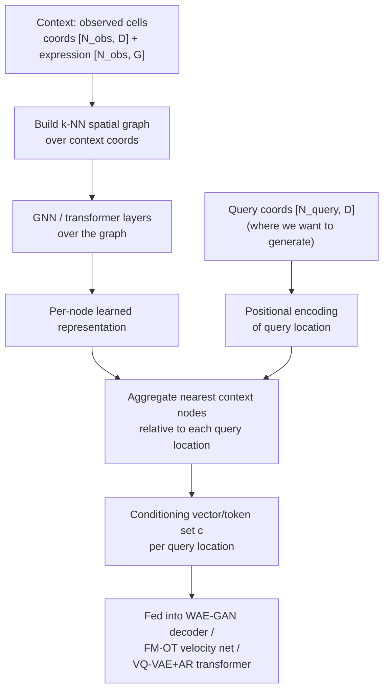
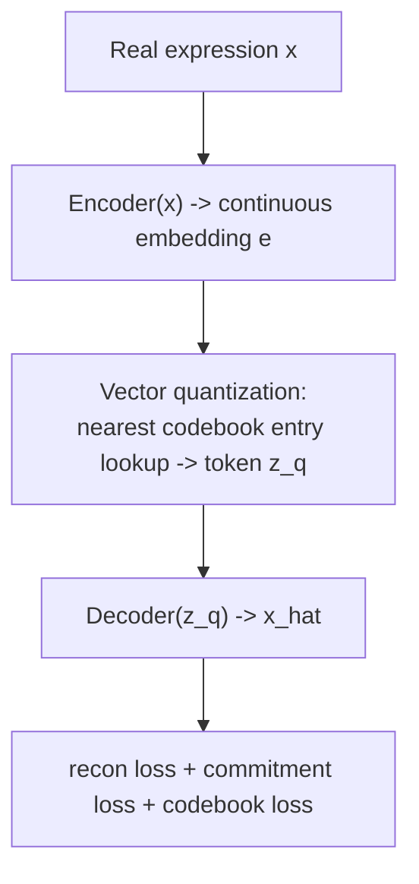
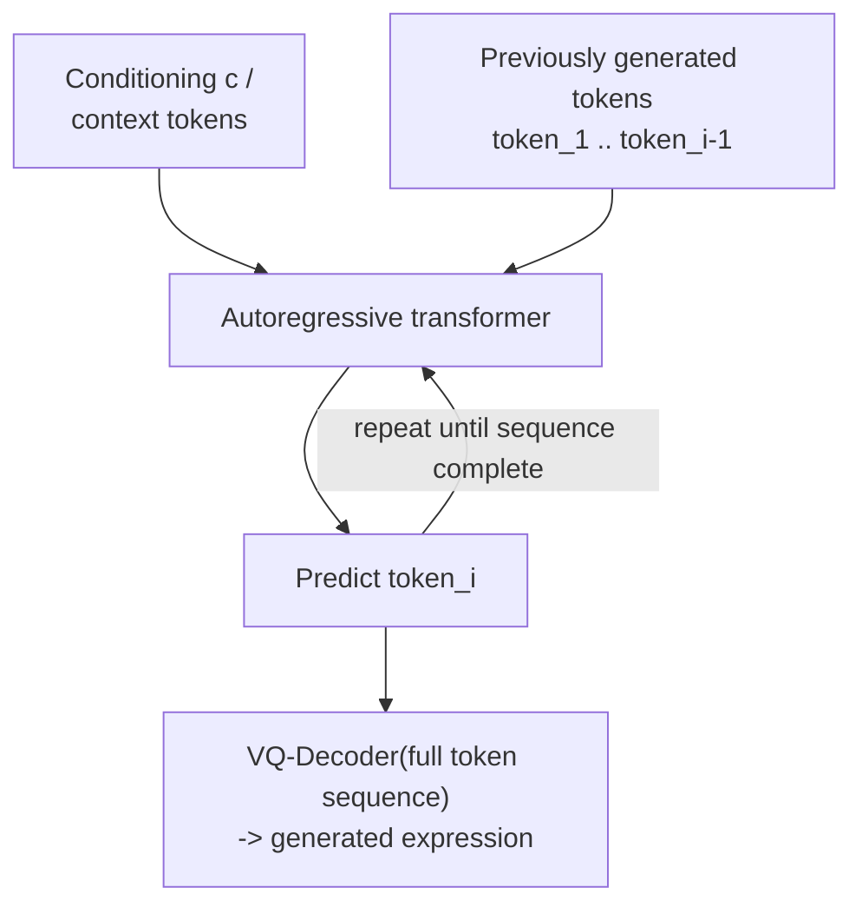

# Model Schematics & Build Plan

Internal architecture of each registry entry in the settled roster
(`docs/architecture_plan.md`), what's still missing per model, and the
concrete build order. Companion to the pipeline-level workflow schematic
already in `docs/architecture_plan.md` — this doc is one level deeper, into
each model's internals.

## Shared component: conditioning encoder (blocks all three)

**Status: written, in `src/models/conditioning.py` (`SpatialContextEncoder`)
— not yet executed anywhere with torch installed.** Smoke test at
`tests/test_conditioning.py` (synthetic data, no real dataset needed) still
needs to actually be run to confirm it works as reasoned through. Not yet
wired into any generator (`wae_gan`, task #8).

Implementation notes vs. the original schematic below: no `torch_geometric`
dependency — k-NN + message passing is done directly in plain PyTorch
(`cdist`/`topk`, same pattern as `InterpolationBaseline`). Design grounded
in peer-reviewed work independent of any single unreviewed preprint: Random
Fourier coordinate encoding (Rahimi & Recht 2007, Tancik et al. 2020,
NeurIPS both), and k-NN graph attention for spatial context specifically
validated in ST by SpaGCN (*Nat Methods* 2021), GraphST (*Nat Commun*
2023), and GAAEST (*Commun Biol* 2024) — see `src/models/conditioning.py`
docstring for full citations. Deliberately ST-only (no H&E) — see "Known
gaps" below — but designed so an image-encoder branch can be fused into
`node_repr`/`query_feat` later without changing any downstream model, since
they only ever consume this module's output `c`.



Remaining open design decision: point-cloud/graph representation vs. fixed
patches, depends on which pilot dataset gets pulled first (spot vs.
single-cell resolution, `docs/project_outline.md` Phase 4) — not yet
resolved since no real dataset is loaded.

---

## 1. WAE-GAN (built, conditioning wired in — smoke-tested, not yet run on real data)

```mermaid
flowchart TD
    subgraph Training
    X["Real expression x"] --> ENC["Encoder(x) -> z_fake"]
    ZR["z_real ~ N(0,I)"] --> DISC["Discriminator"]
    ENC --> DISC
    DISC --> DLOSS["Adversarial loss\non latent code only"]
    ENC --> DEC["Decoder(z_fake, c) -> x_hat"]
    C1["Conditioning c"] --> DEC
    DEC --> RLOSS["Reconstruction loss\n(x_hat vs x)"]
    end
    subgraph Generation / sample&#40;&#41;
    ZP["z ~ N(0,I)"] --> DEC2["Decoder(z, c)"]
    C2["Conditioning c"] --> DEC2
    DEC2 --> OUT["Generated expression"]
    end
```

**Done**: `c` (from its own `SpatialContextEncoder` instance) is
concatenated with `z` before the decoder. One thing this also fixed along
the way: `training_step` previously trained as a plain autoencoder on
context alone and never used `target_expression` — now `z` is encoded from
the real held-out target (available during training only), and the decoder
learns to reconstruct it from `(z, c)`. Smoke-tested with synthetic data
(`tests/test_wae_gan.py`) — not yet run on real data (blocked on task #9).

---

## 2. FM-OT (to build)

```mermaid
flowchart TD
    subgraph Training
    X1["Real expression x_1\n(target)"] --> XT["x_t = (1-t)*x_0 + t*x_1\n(OT straight-line path)"]
    X0["Noise x_0 ~ N(0,I)"] --> XT
    T["t ~ Uniform(0,1)"] --> XT
    T --> TE["Time embedding\n(sinusoidal)"]
    XT --> V["Velocity network\nv_theta(x_t, t_embed, c)"]
    TE --> V
    C3["Conditioning c"] --> V
    V --> LOSS["MSE(v_theta, x_1 - x_0)"]
    end
    subgraph Generation / sample&#40;&#41;
    X0S["x_0 ~ N(0,I)\n(start point)"] --> ODE["ODE solve: dx/dt = v_theta(x_t, t, c)\nintegrate t=0 -> t=1"]
    C4["Conditioning c"] --> ODE
    ODE --> OUT2["x_1 = generated expression"]
    end
```

**Additional parts needed (none exist yet):**
- Time embedding module (sinusoidal, standard/reusable pattern).
- Velocity network `v_θ(x_t, t, c)` — an MLP or small transformer, same
  input/output shape as expression, conditioned on `t` and `c`.
- Conditional flow matching training loop (the diagram above — no
  scheduler library needed for this part, it's a direct regression).
- ODE integrator for sampling — `diffusers` has
  `FlowMatchEulerDiscreteScheduler` which is directly usable here (worth
  checking it fits our non-image data shape); `torchdiffeq` is the fallback
  if not.
- The cheap diffusion-path ablation (`docs/architecture_plan.md`): same
  velocity network, swap the `x_t` interpolation formula for a diffusion-style
  schedule — a training-loop config flag, not new modules.

---

## 3. VQ-VAE + Autoregressive Transformer (to build, two stages)

**Stage 1 — VQ-VAE (learn a discrete representation).** Get this working
and validated on its own before touching stage 2.



**Stage 2 — autoregressive transformer (learn to generate token
sequences), built on top of stage 1's frozen or co-trained codebook.**



**Additional parts needed (none exist yet):**
- VQ layer: encoder + learnable codebook + straight-through-estimator
  quantization + decoder. Worth checking a library implementation (e.g.
  `vector-quantize-pytorch`) before writing this from scratch — it's a
  well-solved, fiddly-to-get-right component.
- **Open design decision, decide before building**: token granularity —
  one token per cell's whole expression vector, or per gene-chunk? Affects
  sequence length and what the transformer actually models.
- Autoregressive transformer decoder (causal self-attention over the token
  sequence, cross-attention or prefix-conditioning on `c`).
- A generation ordering scheme — arbitrary order, or informed like Mimyr's
  GRN-based gene ordering (`docs/literature_review.md`) if going per-gene.
- Known cost, already flagged: autoregressive sampling is sequential and
  slow, worth designing with this in mind (e.g. cache attention states) —
  matters most for the many repeated samples FID/MMD evaluation needs.

---

## Consolidated list of everything still missing

| Part | Needed by | Status |
|---|---|---|
| Conditioning encoder | All 3 | **Done** — verified via `tests/test_conditioning.py` |
| Decoder conditioning injection | WAE-GAN | **Done** — verified via `tests/test_wae_gan.py` |
| Time embedding | FM-OT | Not built |
| Velocity network | FM-OT | Not built |
| ODE sampler | FM-OT | Not built (check `diffusers` first) |
| VQ layer (encoder/codebook/decoder) | VQ-VAE+AR | Not built (check libraries first) |
| Autoregressive transformer | VQ-VAE+AR | Not built |
| Real per-cell/mini-batch `Dataset` | All 3 (for real training) | **Done** — `MaskedContextQueryDataset`, verified via `tests/test_masked_dataset.py` |
| HEST-1k loader (`load_hest_sample`) | All 3 (for real training) | **Written** — not yet run against an actual downloaded sample |
| Independent cell-type classifier | Evaluation (all 3) | Not built |
| Real FID/MMD embedding function | Evaluation (all 3) | Placeholder (PCA) only |

## Step-by-step build order

1. **Conditioning encoder.** Blocks everything below from being meaningful.
2. **Wire conditioning into WAE-GAN.** Cheapest possible win — proves the
   conditioning encoder actually works end-to-end on a model that already
   exists, before building two more models on top of an unproven encoder.
3. **Pull one real pilot dataset** through `src/data/loaders.py`, replace
   `_SingleBatchDataset` with a real mini-batch `Dataset`/`DataLoader`.
   Needed before FM-OT or VQ-VAE+AR training makes sense — both need many
   varied examples, not one repeated batch.
4. **Build FM-OT**: time embedding → velocity network → conditional flow
   matching training loop → ODE sampler. Validate against the "generation
   quality gradient" sanity check (`docs/metrics_notes.md`) before trusting
   it.
5. **Build VQ-VAE stage 1** (reconstruction only) and validate reconstruction
   quality alone before adding the autoregressive transformer — don't debug
   both stages' bugs simultaneously.
6. **Add the autoregressive transformer** (stage 2) on top of a validated
   VQ-VAE.
7. **Build the independent cell-type classifier** — needed for the
   plausibility-check evaluation (`docs/architecture_plan.md` "Design
   decision").
8. **Implement a real FID/MMD embedding** — replace the PCA placeholder,
   validate per the plan in `docs/metrics_notes.md` §2.
9. **Run the full comparison**: VAE (floor) / WAE-GAN / FM-OT /
   VQ-VAE+AR, on the pilot dataset, full metric suite.
10. **Get Mimyr's/isoST's public code running** as external baselines on
    the same data for the head-to-head comparison.
